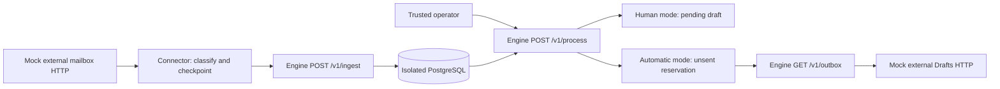

# Review modes and an external HTTP simulation

For subsequent packaging, readiness, and Docker verification, see the
[V1 release record](V1_RELEASE.md).

Updated September 8, 2026. This is local implementation and synthetic verification,
not a deployment or a connected real mailbox.

## The product contract

Human review is the default. A trusted operator can select automatic authorization
in the same policy file used for eligibility and drafting:

```yaml
review:
  mode: human  # automatic explicitly permits authorization without a reviewer
```

Omitting `review` preserves human mode. Unknown modes, extra fields, and boolean
substitutes fail configuration validation. Email text, ingestion payloads, and
processing request bodies cannot change this policy.

| Mode | Processing result | Outbox | Audit |
| --- | --- | --- | --- |
| `human` | Pending draft for CLI review | No reservation until approval | Manual approval records `human` and a review time |
| `automatic` | Valid draft automatically authorized | Unsent reservation | Records `automatic`; human review time stays null |

Both authorization paths use the same copy/version checks, contact locks,
current recipient and opportunity checks, cooldown, and reservation uniqueness.
Automatic authorization is permission to reserve the validated copy, not proof
that it is contextually useful. Drafting still receives limited name/tone/count
context. Neither path sends messages.

The setting applies to each CLI run or HTTP processing request. Changing to
automatic can authorize existing pending drafts. Changing back to human affects
later decisions; it does not revoke previously authorized reservations, change
their provenance, or interrupt an already running batch. Rejected and approved
history is retained.

Schema initialization adds `outbox.authorization_mode` idempotently. Existing
rows become `legacy_unknown`, because historical rows do not prove who approved
them. Their content and other state are preserved. Initialize with the upgraded
application before invoking its review or outbox services. Back up a persistent
database before upgrading; this additive change does not migrate the old
quote-specific prototype schema.

## API and CLI use

Ingestion remains inert: `POST /v1/ingest` only imports canonical data. Processing
is a separate operator action:

| Endpoint | Purpose |
| --- | --- |
| `POST /v1/process` | Sync eligible candidates, generate drafts, then follow the server's review policy |
| `GET /v1/drafts` | Inspect pending and historical drafts |
| `GET /v1/outbox` | Inspect reservations, including authorization provenance |
| `GET /v1/inbox` | Inspect unanswered ingested human replies and their evidence |

Processing is disabled (404) unless the server has a nonempty `RESPAWNED_PROCESS_TOKEN`.
When enabled, it requires `Authorization: Bearer <operator-token>` (otherwise
401). Authentication happens before resolving the database or drafting model.
Keep this credential out of source-reader agents and external message content.
It permits processing under current server policy; it cannot certify human
approval. There is no remote human-approval endpoint.

For a host-based development server, set the normal database/model environment,
set a private random `RESPAWNED_PROCESS_TOKEN`, and select a policy with
`RESPAWNED_POLICY_PATH=/absolute/path/to/policy.yaml`. Then run:

```bash
uv run --env-file .env respawned serve --host 127.0.0.1 --port 8000
```

For a local shell that already has the operator token in its environment:

```bash
curl --fail-with-body http://localhost:8000/v1/process \
  -H "Authorization: Bearer $RESPAWNED_PROCESS_TOKEN" \
  -H 'Content-Type: application/json' -d '{"limit": 10}'
curl --fail-with-body 'http://localhost:8000/v1/drafts?limit=50&offset=0'
curl --fail-with-body 'http://localhost:8000/v1/outbox?limit=50&offset=0'
```

`limit` is the only processing parameter (integer 1–50). Policy, time, and
authorization actor are controlled by the server. The response reports
`review_mode`, `candidate_count`, and per-item `pending`, `authorized`, `blocked`,
or `already_reviewed` outcomes. A 200 response does not mean every item succeeded:
inspect those outcomes. Expected model failures block individual items. Completed
steps commit independently, so an unexpected failure can leave earlier progress
available through the reads; retrying reuses persisted work.

The CLI honors the same policy through `review --policy path/to/policy.yaml`.
In human mode it presents copy and recipient for approve/reject/edit/skip.
Automatic mode does not prompt and reports automatic authorizations separately.

Compose passes an optional processing token and model configuration to the app.
Enable both the `app` and `litellm` profiles for the bundled proxy, or set
`APP_LITELLM_PROXY_URL` to a proxy reachable from the container. The default
policy remains bundled and human. To use a custom container policy,
mount that file read-only and set `RESPAWNED_POLICY_PATH` to its container path in a
Compose override. The path in the host `.env` alone does not mount a file.

The new reads support `limit` (1–200) and `offset`, returning `items` and `has_more`.
These are bounded snapshot reads, not a durable change feed, delivery claim, or
reservation cancellation API. Ingestion and reads remain unauthenticated and
single-tenant; keep the service on loopback or a trusted private network.

## What the simulation connects



`scripts/simulate_connector.py` starts two real HTTP servers on random loopback
ports and creates a fresh PostgreSQL schema for each review mode. The mock source
returns message pages with provider IDs, timestamps, sender/direction, explicit
reference IDs, automatic-reply headers, and a known-record catalog. Its message
text includes an instruction to disable review and send; that text is evidence,
never operator configuration.

The connector freezes its canonical batch on disk before POSTing. A lost
acknowledgment is simulated after the real ingestion response: restarting the
connector retries the exact saved batch without rerunning extraction. It advances
its cursor only after a valid ingestion acknowledgment. A conflicting page stays
pending for correction. The cursor tracks source ingestion, separately from
subsequent model processing.

After processing, a mirror reads engine outbox JSON and POSTs the exact recipient
and copy to the mock provider's Drafts endpoint. That fake endpoint has deliberate
idempotency support. This does not establish the same behavior in Gmail or another
provider. Exporting leaves the engine reservation pending and its send time null.

The checks cover both modes, restart/replay, automatic-reply classification,
unauthorized processing, rejected policy overrides, duplicate processing,
automatic provenance, repeated external draft creation, switching back to human,
a model outage after successful source ingestion, and conflicting-batch rollback.

## Reproduce

Set `SIMULATION_POSTGRES_URL` to an existing test PostgreSQL database where the
current user can create schemas. As in [the other simulations](SIMULATIONS.md),
only uniquely generated schemas are created and removed; existing schemas stay
untouched. The runner stops its HTTP servers and preserves its evidence files.
Output directories must be new.

```bash
uv run --frozen python scripts/simulate_connector.py \
  --output exports/connector-simulations/scripted-1
```

By default, classification and copy are scripted for reproducible boundary checks.
To use the already supported, logged-in ChatGPT Codex CLI for classification and
drafting instead:

```bash
uv run --frozen python scripts/simulate_connector.py \
  --codex-bin codex --output exports/connector-simulations/codex-1
```

Windows Codex invoked from WSL also needs `--scratch-dir` on a Windows-mounted
temporary directory. The [agent simulation guide](AGENT_SIMULATIONS.md) describes
the constrained CLI invocation and retained model evidence. Live execution uses
Codex usage, without provisioning or falling back to an API key.

Here Codex maps fetched pages and supplies draft copy; connector retries and
checkpoints are deterministic. The earlier agent simulation additionally tests
multi-turn agents choosing ingestion, inbox, and retry tools. Neither experiment
establishes reliability from a few examples. An independent fixture oracle checks
the imported classifications instead of accepting model self-assessment.

`REPORT.md` summarizes checks; `results.json`, per-mode evidence, saved checkpoints,
and optional Codex event logs retain the details. These generated exports are
ignored by Git and contain only synthetic messages in these runs.

## Verification recorded September 8

- **359 tests passed** against isolated PostgreSQL 16.15; four Docker lifecycle
  tests were excluded. The sole warning is an upstream TestClient deprecation.
- Both scripted HTTP scenarios passed, including lost acknowledgments and a
  model outage. Focused harness regressions reject malformed acknowledgments,
  changed source facts/recipients, and conflicting external draft replays.
- Both Codex-backed HTTP scenarios passed with the final harness: 19 checks per
  mode and 10 completed CLI calls (about 93 seconds total). This is an exploratory
  run, not a reliability percentage. Evidence is in
  `exports/connector-simulations/2026-09-08-codex-3/REPORT.md`.
- The first live attempt exposed a strict-output schema mismatch; the simulation
  now wraps model JSON and validates it against the unchanged ingestion contract.
  A second attempt exposed a harness error that rejected recovered transport
  retries despite successful terminal completion. The corrected runner requires
  a final `turn.completed`, rejects failed/incomplete turns and prohibited native
  tools, and still rejects nonzero exit/timeout even with a valid output file.
  Both earlier reports and raw logs remain preserved under `codex-1` and `codex-2`.
- Dependency-lock and Git whitespace checks passed. Compose configuration parsed
  successfully without starting services; container lifecycle remains unverified.

## Remaining product work

This is a sequential, single-writer connector example. Opportunity snapshots
still lack source revisions; an older snapshot can overwrite newer fields.
Connector-local checkpoints are not engine-owned durable freshness or scheduling.
The example does not establish recovery from disk/power failure.

A real provider adapter needs authentication, account/thread context, provider
draft identity, reconciliation after ambiguous outcomes, and rules for user edits
to exported drafts. An outbox worker additionally needs atomic claims/leases,
delivery-result recording, cancellation, and eligibility/freshness checks at the
point of action. No live inbox, native Gmail draft, or send has been exercised.
Bounded drafting context and trackable records without a recipient remain the
highest-value product improvements from the previous simulations.
