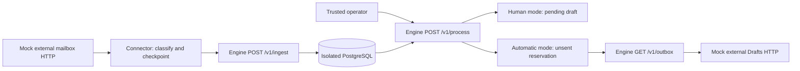

# External HTTP connector simulation

This guide reproduces the connector harness and retains its September 8, 2026
results. It exercises synthetic mailboxes and an unsent external draft mirror,
not a live provider or message delivery.

Use the [API and policy guide](API.md) for the current ingestion, processing,
review-mode, and outbox contracts. Human policy leaves a draft pending;
automatic policy can reserve a validated unsent message. Both use the same
eligibility and review checks. The current application also supports protected
human review through the bundled UI/API and richer record context than the
original simulation build. [Integration qualification](INTEGRATION_REVIEW.md)
records subsequent UI checks and separate optional adapter experiments.

## What the simulation connects



`scripts/simulate_connector.py` starts two real HTTP servers on random loopback
ports and creates a fresh PostgreSQL schema for each review mode. The mock source
returns message pages with provider IDs, timestamps, sender/direction, explicit
reference IDs, automatic-reply headers, and a known-record catalog. Its message
text includes an instruction to disable review and send; that text is evidence,
never operator configuration.

The connector freezes its canonical batch on disk before POSTing. A lost
acknowledgment is simulated after the real ingestion response: restarting the
connector retries the exact saved batch without rerunning extraction. It advances
its cursor only after a valid ingestion acknowledgment. A conflicting page stays
pending for correction. The cursor tracks source ingestion, separately from
subsequent model processing.

After processing, a mirror reads engine outbox JSON and POSTs the exact recipient
and copy to the mock provider's Drafts endpoint. That fake endpoint has deliberate
idempotency support. This does not establish the same behavior in Gmail or another
provider. Exporting leaves the engine reservation pending and its send time null.

The checks cover both modes, restart/replay, automatic-reply classification,
unauthorized processing, rejected policy overrides, duplicate processing,
automatic provenance, repeated external draft creation, switching back to human,
a model outage after successful source ingestion, and conflicting-batch rollback.

## Reproduce

Set `SIMULATION_POSTGRES_URL` to an existing test PostgreSQL database where the
current user can create schemas. As in [the other simulations](SIMULATIONS.md),
only uniquely generated schemas are created and removed; existing schemas stay
untouched. The runner stops its HTTP servers and preserves its evidence files.
Output directories must be new.

```bash
uv run --frozen python scripts/simulate_connector.py \
  --output exports/connector-simulations/scripted-1
```

By default, classification and copy are scripted for reproducible boundary checks.
The existing Codex runner can optionally supply classification and copy in an
experiment. This is not an application setup step or release requirement:

```bash
uv run --frozen python scripts/simulate_connector.py \
  --codex-bin codex --output exports/connector-simulations/codex-1
```

Windows Codex invoked from WSL also needs `--scratch-dir` on a Windows-mounted
temporary directory. The [agent simulation guide](AGENT_SIMULATIONS.md) describes
the constrained CLI invocation and retained model evidence. Live execution uses
Codex usage, without provisioning or falling back to an API key.

Here Codex maps fetched pages and supplies draft copy; connector retries and
checkpoints are deterministic. The earlier agent simulation additionally tests
multi-turn agents choosing ingestion, inbox, and retry tools. Neither experiment
establishes reliability from a few examples. An independent fixture oracle checks
the imported classifications instead of accepting model self-assessment.

`REPORT.md` summarizes checks; `results.json`, per-mode evidence, saved checkpoints,
and optional Codex event logs retain the details. These generated exports are
ignored by Git and contain only synthetic messages in these runs.

## Verification recorded September 8

- **359 tests passed** against isolated PostgreSQL 16.15; four Docker lifecycle
  tests were excluded. The sole warning is an upstream TestClient deprecation.
- Both scripted HTTP scenarios passed, including lost acknowledgments and a
  model outage. Focused harness regressions reject malformed acknowledgments,
  changed source facts/recipients, and conflicting external draft replays.
- Both Codex-backed HTTP scenarios passed with the final harness: 19 checks per
  mode and 10 completed CLI calls (about 93 seconds total). This is an exploratory
  run, not a reliability percentage. Evidence is in
  `exports/connector-simulations/2026-09-08-codex-3/REPORT.md`.
- The first live attempt exposed a strict-output schema mismatch; the simulation
  now wraps model JSON and validates it against the unchanged ingestion contract.
  A second attempt exposed a harness error that rejected recovered transport
  retries despite successful terminal completion. The corrected runner requires
  a final `turn.completed`, rejects failed/incomplete turns and prohibited native
  tools, and still rejects nonzero exit/timeout even with a valid output file.
  Both earlier reports and raw logs remain preserved under `codex-1` and `codex-2`.
- Dependency-lock and Git whitespace checks passed. Compose configuration parsed
  successfully without starting services; container lifecycle remains unverified.

## Remaining product work

This is a sequential, single-writer connector example. Opportunity snapshots
still lack source revisions; an older snapshot can overwrite newer fields.
Connector-local checkpoints are not engine-owned durable freshness or scheduling.
The example does not establish recovery from disk/power failure.

A real provider adapter needs authentication, account/thread context, provider
draft identity, reconciliation after ambiguous outcomes, and rules for user edits
to exported drafts. An outbox worker additionally needs atomic claims/leases,
delivery-result recording, cancellation, and eligibility/freshness checks at the
point of action. No live inbox, native Gmail draft, or send has been exercised.
Bounded drafting context and trackable records without a recipient have since
been implemented; the unresolved work is provider integration and durable source
association/freshness, not a separate workflow engine.
