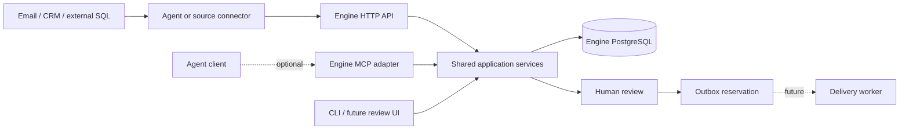

# Proposals: agent-assisted follow-up workflows

Status: design discussion, not implemented as a whole. Updated September 5, 2026.

Current implementation note (September 9, 2026): the source checkout now includes
the [shared browser review UI](WEB_UI.md), bounded record context, tracking without
a known recipient, explicit human/automated activity classification, and
application/deadline follow-up rules. Local authenticated review writes to the
existing unsent outbox. Mailbox discovery, source reconciliation, unresolved
association review, monitoring, and delivery remain proposals. The sections below
preserve the earlier discussion and do not describe a new published release.

Subsequent implementation: [review modes and HTTP connector simulation](CONNECTOR_SIMULATION.md) adds operator-selected automatic authorization and workflow reads/processing. Human review remains the default; the human-only wording below records the earlier proposal.

This document preserves the direction discussed after the canonical API refactor. It is not a promise that every feature will ship. [HANDOFF.md](HANDOFF.md) describes what actually exists at `d682d8a`.

## Product intent and boundaries

Help users discover work that needs follow-up, understand subsequent correspondence, and act on it with durable history and explicit review. Job applications, music submissions, and sales opportunities are examples of the same broader need.

The engine keeps its own durable database for state, review history, cooldowns, and outbox reservations. External data may come from Gmail, a CRM, a warehouse, a SQL database, or an agent with access to those systems.

The public ingestion contract should be reusable across those sources. External SQL access belongs to a source connector, just as Gmail access does. A connector can submit canonical batches through HTTP; an in-process adapter can call the same ingestion service. Internal `db/` code continues to own engine persistence.

MCP is an optional interface. The earlier suggestion to turn the entire product into an MCP server was reconsidered after the user expressed uncertainty. No wholesale rewrite or MCP-first implementation was agreed. An agent may consume an external Gmail MCP server while using this engine's HTTP API. A future engine MCP adapter would call the same core services.

## Reference workflow: job applications

User request: "Find all the confirmation emails from job applications from the last three weeks, create a list of the firms I've applied to, and track further correspondence for each."

1. **Discover evidence.** Search the selected mailbox and date range for application confirmations. Inspect relevant messages to extract employer, role, submission date, application/reference ID, and source message/thread references. A confirmation search cannot prove completeness: applications without receipts must remain outside the reported coverage.
2. **Build the tracker.** Store one record per application. Group records by firm for presentation, but keep two roles at the same firm separate. Repeated searches must reuse existing source identities rather than create duplicates.
3. **Resolve ambiguity.** Attach source evidence to extracted fields. Clear records can be imported under the user's discovery instruction; uncertain employer, role, duplicate, or correspondence matches should be surfaced for correction. The exact bulk-review experience is still open.
4. **Associate correspondence.** Attach messages in known threads, then look for application/reference IDs and supporting role/contact evidence across threads. A recruiter may start a new thread after an automated receipt. Company name or a shared ATS domain alone is insufficient to merge records.
5. **Track changes.** After the user chooses a cadence, run incremental updates, attach new correspondence, and report meaningful changes. Advance source checkpoints only after processing succeeds. Monitoring is a proposed product capability, not something already scheduled by this conversation.
6. **Suggest action.** Distinguish waiting for the employer from owing them a response. Show relevant dates and evidence. Automated confirmations and vacation replies must not count as human responses.
7. **Draft when useful.** Once a real recipient is known, use a bounded summary and source context to prepare a follow-up. Human review remains required. Creating a native Gmail draft is the suggested first delivery integration; direct sending is a later decision.

Illustrative tracker, not real mailbox data:

| Firm | Role | Application state | Latest correspondence | Next action |
| --- | --- | --- | --- | --- |
| Acme | Backend Engineer | Applied | Automated receipt | Track; human contact unknown |
| Acme | Platform Engineer | Interviewing | Recruiter requested availability | Reply needed |
| Northstar | Data Engineer | Rejected | Explicit rejection | Closed; suppress follow-up |

A record should be trackable before it is contactable. Never turn a no-reply receipt address into an intended recipient just to satisfy the current schema.

## Agent and engine responsibilities

| Agent-assisted judgment | Deterministic application behavior |
| --- | --- |
| Recognize confirmations, roles, companies, and relevant correspondence | Preserve provider IDs, timestamps, sender/direction evidence, and replay semantics |
| Propose links between an application and a new thread | Apply confirmed associations without duplicate events |
| Summarize correspondence and explain uncertainty | Store evidence, source links, and corrections |
| Draft with approved context and tone | Validate copy, enforce eligibility/cooldown, and require approval |

Source text is evidence, not authorization. Exposing an approval tool to an agent does not establish that a human approved a message. Any future HTTP/MCP approval endpoint needs an explicit human authorization mechanism bound to the draft/version being approved.

## Decisions still open

| Decision | Suggested direction | Why it needs a decision |
| --- | --- | --- |
| Canonical noun | Consider `engagement`; retain `opportunity` until settled | The user has not approved a schema-wide rename. Avoid parallel aliases and churn driven only by terminology. |
| Lifecycle | Consider generic active/closed state with separate outcome | `open/won/lost` is current; `active/succeeded/closed` was also proposed. Job stages such as interviewing should not automatically become universal core statuses. |
| Contactless records | Allow tracking with no recipient or contact identity | Current ingestion requires both a contact key and a route. Do not fabricate person identities from company names. |
| Multiple people | Separate the tracked application from its correspondents | An application can involve a receipt sender, recruiter, and hiring manager; grouping and cooldown must still follow the intended recipient. |
| Source access | Prove one Gmail workflow through an existing agent tool or a small connector | Building both a native connector and MCP infrastructure immediately would duplicate effort. |
| Context storage | Keep source references plus bounded, purposeful context | Whole-mailbox storage is unnecessary for the first workflow; retention and refresh behavior need definition. |
| Monitoring | Explicit scope, cadence, cursor, and failure state | An interactive agent session or an MCP server alone does not schedule future work. |
| Review location | Engine review first; explore native Gmail drafts | A user can send a native draft later, so exporting a draft cannot be treated as completed delivery or guarantee a fresh cooldown check at send time. |

## Candidate model and service changes

These are proposed capabilities, not final migrations or endpoint names:

- Optional record title/kind and bounded drafting context, so copy can mention a role or submission without sales-specific wording.
- Trackable records without a contact route; eligibility must still exclude them from send candidates.
- Source associations for multiple messages/threads per record, namespaced by connection/account. Define how shared messages and later merge/split corrections work before choosing uniqueness constraints.
- An `awaiting_reply` evaluator based on the latest outbound and later human correspondence. An application with only an automated receipt may need a separate `application_no_update` signal based on submission time.
- Source sync checkpoints and freshness information. Internal approval currently sees only ingested state; source refresh failures must be visible before future delivery decisions.
- Query services/API endpoints for listing tracked records, their evidence, and candidates. Current HTTP support covers health and ingestion only.
- Delivery context identifying the sender account, thread, and reply information; provider delivery outcomes tracked separately from draft creation and outbox reservation.

Do not make a Gmail thread the universal record ID. One application may span several threads; one thread may discuss several applications. Strong source references can support identity, but uncertain semantic links need correction rather than silent merging.

## Suggested implementation slices

| Slice | Reviewable result | Essential acceptance cases |
| --- | --- | --- |
| 1. Tracking contract | A fixture-backed application tracker, listing firms and roles with evidence | No human recipient required; two roles at one firm stay distinct; repeating import creates no duplicates; contactless records cannot be sent to |
| 2. Discovery and linking | One agent/source integration turns confirmation messages into records | Receipt is not a human reply; shared ATS sender does not merge employers; strong cross-thread match links correctly; ambiguous match remains unresolved |
| 3. Ongoing tracking | Incremental correspondence updates with visible sync status | Retry replays safely; checkpoint does not advance after failure; human reply and rejection update the correct application |
| 4. Follow-up assistance | Waiting-for-reply policy and contextual human-reviewed drafts | Later reply supersedes waiting; rejection blocks action; intended recipient and context are shown; stale source state is handled explicitly |
| 5. Delivery and interfaces | Native drafts or worker delivery, then optional MCP/web surface | Draft creation differs from sending; ambiguous provider outcomes are not blindly retried; human approval cannot be fabricated by a tool call |

The immediate proposed slice is the tracker and its minimal data contract. It provides something useful to inspect before choosing a large connector framework or a new interface.

## Deferred work

External database connectors can use read-only credentials and explicit queries/views that map to the canonical contract. An agent could help propose the mapping from sample records; repeated ingestion should then run mechanically. A general schema-inference system is not needed initially.

MCP tool names discussed included tracking records, recording activities, listing candidates/evidence, creating drafts, snoozing, closing, and recording delivery results. These are an illustrative inventory, not an approved contract. Add only tools justified by the working flow, reusing core services.

A delivery worker, improved CLI/web review UX, tenant/account isolation, and incremental state projections remain valuable follow-ons. Model evaluation and learned ranking weights are deferred; existing policy defaults are transparent placeholders, and hard suppressors must remain independent of any learned ranking.

Gmail authentication, incremental synchronization, thread reply semantics, scope requirements, and ambiguous-send recovery require a fresh check of provider documentation during implementation. Earlier discussion established feasibility, not a tested Gmail integration.
